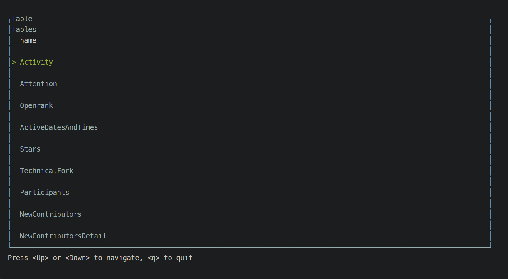

# 命令行交互的指标结果查询子模块 产品设计文档

## 一 项目背景

​ 近年来，GitHub 等代码托管平台已成为程序员、开发者之间交流和合作的重要平台。对于项目质量的评估，在平台上一直是一个十分重要的话题。其中，项目的 GitHub 指标成为评估项目的重要因素之一。而 OpenDigger 作为开源生态数据分析的核心项目，负责与开源测量学相关的一切数据、指标、模型、算法等落库与实现，是一个具有共识性的实施标准工具集。目前，OpenDigger 提供的这些指标以 HTTPS URL 的形式提供 JSON 数据文件的查询结果，用户想查询某一个仓库在某一个指标的对应数据时，可以通过修改 URL 的方式请求得到。
​ 现在，随着人们对命令行交互的需求越来越高，我们可以考虑使用命令行查看 OpenDigger 的指标结果。命令行交互的优势在于，它不依赖于图形用户界面（GUI），无需鼠标和其他外设，可以通过键盘快捷键和命令行输入与程序进行交互。这使得命令行交互成为一种高效、快捷的交互方式，特别在需要快速访问和操作多个文件、目录和系统层面时，在效率上有着优势。对很多开发者而言，命令行交互的方式相比修改 url 更加快捷，方便他们基于此做更多开发工作。
​ 本项目的目标在于，通过命令行交互方式，使 OpenDigger 提供一种方便、快捷的指标查询方式，用户可以利用 OpenDigger 提供的命令接口，查询 GitHub 上的指定仓库在各种指标上的表现，并在命令行界面上直接得到查询结果和相关信息或者得到一份下载文件。通过命令行交互的方式，用户可以不必登录任何平台或第三方网站，直接在控制台上查询和处理 GitHub 项目指标信息，这使得 OpenDigger 可以更快速、方便地提供 GitHub 项目指标查询服务，为项目评估和开发带来更高效的方式。

## 二 用户需求分析

### （1）用户类型

- 开发人员：有相关的计算机基础知识和编程能力，希望通过 OpenDigger 发掘 Github 上项目的指标信息。熟悉命令行界面，能够快速找到合适的交互方式。
- 项目管理人员：本身参与了自己项目的管理，希望通过 OpenDigger 找到自己参与的项目的指标信息，进行相关数据分析，得到项目优化方向。大部分有命令行使用经验。
- 普通用户：希望能够使用 OpenDigger 得到新的指标信息，用于非计算机相关的其他领域。工程经验可能不足，需要专业门槛较低的命令行使用方案。

### （2）用户需求

​ 通过命令行工具，用户能够得到相应的查询结果，包括：

1. 查询**特定仓库**在**特定指标**上的数据

2. 查询**特定仓库**在**某一类指标**上的数据

3. 查询**特定仓库**在**特定自然月**上在**特定指标**上的数据

4. 查询**特定仓库**在**特定自然月**上在**某一类指标**上的数据

5. 查询**特定仓库**在**特定自然月份**上的**整体报告**

6. 查询**特定仓库**在**特定自然月份**上的在**某一类指标**上的报告

7. 查询**特定用户**在**特定指标**上的数据

8. 查询**特定用户**在**特定自然月**上在**特定指标**上的数据

9. 查询**特定用户**在**特定自然月份**上的**整体报告**

   注意命令行交互虽然简洁，但有一定的专业性。我们的目标是让所有用户（包括计算机相关专业和非计算机相关专业的用户）能够轻松地使用产品，并获得愉悦的使用体验。

   ***

   同时查询得到的整体报告应当有一定的可视化设计，以图表、图像等形式表达数据和信息，具有良好的可读性和表现力，节省用户的时间和精力，使用户可以更深入地探究数据并进行进一步分析。

## 三 产品功能设计

该命令行工具的功能设计包括五个模块：

### 功能 1：原始数据下载

下载特定仓库（或者特定用户）在特定指标（或者某一类指标）上的数据

命令格式如下:

```bash
$ opendigger-cli download <owner> <metric> [-o <output_file_name>]
```

例如:
```bash
$ opendigger-cli download "X-lab2017/open-digger" openrank -o openrank.csv
```


### 功能 2：关系型数据查询

通过 SQL 语句查询特定仓库（或者特定用户）在特定指标（或者某一类指标）上的数据

查询结果被格式化为表格数据，可以直接在命令行中展示/交互或者导出为 CSV 文件。对于某些特定
形式的数据，提供折线图等可视化方式。

```bash
$ opendigger-cli sql <SQL Query> [-o <output_file_name>]
```

例如:

1. 列出所有可用的关系表格

```bash
$ opendigger-cli sql "SHOW TABLES"
```

2. 列出 `Issues` 表格中的所有列

```bash
$ opendigger-cli sql "SHOW COLUMNS FROM Issues"
```

3. 查询 `X-lab2017/open-digger` 仓库在 `Openrank` 指标上的数据

```bash
$ opendigger-cli sql "SELECT * FROM openrank WHERE repo = 'X-lab2017/open-digger'" -o openrank.csv
```

### 功能 2：数据查询报告

针对特定仓库或者特定用户，根据用户需求，给出一份在特定自然月上的整体报告，报告包含各类指标，并且以图表的形式展现

```bash
$ opendigger-cli report <owner> <month> [-o <output_file_name>] [--ui]
```

例如:

```bash
$ opendigger-cli report "X-lab2017/open-digger" "2020-01" -o report.pdf
```

### 功能 3：图数据查询

注意指标中有一部分本身就是图状数据，例如开发者之间的网络、仓库之间的网络，对于这部分数据，我们考虑使用 Cypher 查询图形数据

```bash
$ opendigger-cli cypher <Cypher Query> [-o <output_file_name>] [--ui]
```

例如：

```bash
$ opendigger-cli cypher "MATCH (X-lab2017/open-digger)"
```

### 功能 4：AI 交互式查询

我们关注普通用户的需求，对于不了解 SQL/Cypher 的用户，我们考虑在命令行工具中结合 ChatGPT 相关功能。用户可以描述自己的需求，由我们帮助用户生成 SQL/Cypher 查询语句。
（需配置 `OPENAI_API_KEY`）

```bash
$ opendigger-cli chat <description> [-o <output_file_name>] [--ui]
```

例如：

```bash
$ opendigger-cli chat "仓库'X-lab2017/open-digger’,'vuejs/core' stars 数量的变化，查询结果保留仓库名称"
```

## 四 产品架构和技术方案

### 1.产品架构

### 2.技术方案

##### **1. 开发语言：Rust**

使用 Rust 作为开发语言。选择 Rust 的理由是，Rust 是一种高性能、可靠、安全的系统编程语言，语言支持出色的并发和内存管理能力。同时，支持跨平台的交叉编译，编译产物为单二进制程序，方便分发。

##### **2. ChatGPT 支持**

支持 ChatGPT 生成查询语句。使用该技术是为了方便对 SQL/Cypher 语言不了解的用户使用该 CLI 工具，降低使用成本。

##### **3. TUI 交互**

TUI 界面以文本形式呈现，相比于 GUI 更轻量级，易于修改和维护。

##### **4. DevOps 自动构建**

采用 Github Actions 支持包括编译代码、运行测试、构建和部署应用程序，自动化构建可以显著提高应用程序的构建速度和开发效率。

## 五 项目排期

- [x] 2023 年 5 月 1 日前：开会，分工，完成该项目的方案设计和前期准备
- [x] 2023 年 5 月 5 日前：在代码中完成基本数据下载
- [x] 2023 年 5 月 10 日前：完成基本数据查询
- [x] 2023 年 5 月 15 日前：完成 ChatGPT 支持查询语句生成
- [x] 2023 年 5 月 22 日前：完成复赛方案提交和 Demo 演示
- [ ] 2023 年 5 月 30 日前：完成图数据查询
- [ ] 2023 年 6 月 5 日前：完成查询报告的可视化
- [ ] 2023 年 6 月 15 日前：完成项目测试和调整完善
- [ ] 2023 年 6 月 20 日前：完成产品说明书撰写，介绍如何安装和二次开发
- [ ] 2023 年 6 月 25 日前：完成决赛提交需要的完整内容，使用在线视频进行项目演示

## 六 产品 Demo 和项目进度

1. 基本帮助命令

```bash
$ opendigger-cli help
```


2. 下载 `X-lab2017/open-digger` 仓库在 `Openrank` 指标上的数据

```bash
$ opendigger-cli download "X-lab2017/open-digger" "openrank" -o openrank.json
```


3. 查询所有可用的关系表

```bash
$ opendigger-cli sql "SHOW TABLES"
```



4. 查询 `Issues` 表中的所有列

```bash
$ opendigger-cli sql "SHOW COLUMNS FROM Issues"
```


5. 查询 `X-lab2017/open-digger` 仓库在 `Openrank` 指标上的数据

```bash
$ opendigger-cli sql "SELECT * FROM Openrank WHERE name = 'X-lab2017/open-digger'"
```


6. 查询 `X-lab2017/open-digger` 仓库在 `Openrank` 指标上的数据，并将结果写入文件

```bash
$ opendigger-cli sql "SELECT * FROM Openrank WHERE name = 'X-lab2017/open-digger'" -o openrank.csv > /dev/null
```


7. 查询 `X-lab2017/open-digger` 和 `vuejs/core` 仓库在 `Stars` 指标上的数据, 根据 `month` 进行连接

```bash
$ opendigger-cli sql "SELECT * FROM Stars a LEFT JOIN Stars b ON a.month = b.month WHERE a.name = 'X-lab2017/open-digger' AND b.name = 'vuejs/core'"
```


8. 查询 `X-lab2017/open-digger`, `facebook/react' 和 `vuejs/core` 仓库在 `Stars` 指标上的数据, 交互式 UI 展示

```bash
$ opendigger-cli sql "SELECT * FROM Stars WHERE name = 'X-lab2017/open-digger' OR name = 'facebook/react' OR name = 'vuejs/core'" --ui
```

>
> (支持切换图表类型： `Treading` 和 `Value`)
>


9. ChatGPT 查询

```bash
$ opendigger-cli chat "仓库‘X-lab2017/open-digger’,'vuejs/core' stars 数量的变化, 包含仓库名称" --ui
```

>
> (支持切换图表类型： `Treading` 和 `Value`)
>


## 七 实现难点和未来工作

**该 CLI 工具目前已实现的部分包括：**

* 命令参数的功能设计和解析
  
* 利用 SQL 进行基础查询
  
* 利用 ChatGPT 进行查询语句生成
  
* 查询结果 TUI 交互

**该 CLI 工具的未来工作包括：**

* 利用 Cypher 进行图数据查询

* 查询整体报告的可视化

**该 CLI 工具的实现难点包括：**

* SQL 语句到查询 JSON 数据的解析过程

* 对图形数据的查询处理
